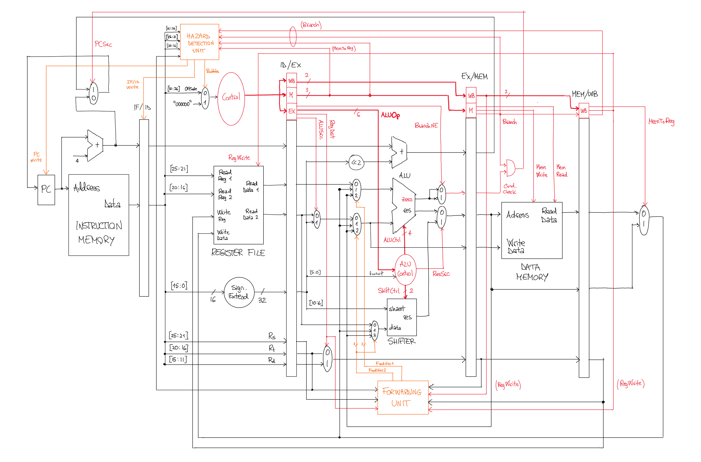

# Pipelined MIPS CPU architecture



This project provides a VHDL implementation of a CPU based on the MIPS architecture. The ISA comprises 21 operations to manage arithmetic/logical expressions, memory access and conditional branches. The instructions are executed via a five-stage RISC pipeline. Data and control hazards are properly handled through a forwarding unit and a hazard detection unit. The project was developed during the MSc course "Digital Systems Electronics" at the University of Udine during the academic year 2019/2020.

Main file: [src/mips_pipeline.vhdl](src/mips_pipeline.vhdl)

## Features

* RISC pipeline: ID, IF, EX, MEM, WB
* Bit-parallelism: 32 bit
* Address space: 32 bit
* Data Hazard detection (read after read/load)
* Control Hazard detection (conditional branch)

## Instruction set

The following table shows the instructions supported. For a more thorough desciption, comprising the control signals that are generated internally, refer to [docs/mips_instruction_set.xlsx](./docs/mips_instruction_set.xlsx)

Instruction | Type | OPCode | Funct | Description
:-: | :-: | :-: | :-: | :--
NOP | - | 000000 | - | `no operation`
SHIFT LL | R | 000001 | 000000 | `rd = rt << shamdt`
SHIFT RL | R | 000001 | 000001 | `rd = rt >> shamdt`
ADD | R | 000001 | 000010 | `rd = rs + rt`
SUB | R | 000001 | 000011 | `rd = rs - rt`
AND	| R | 000001 | 000100 | `rd = rs and rt`
OR | R | 000001	| 000101 | `rd = rs or rt`
NAND | R | 000001 | 000110 | `rd = rs nand rt`
NOR | R | 000001 | 000111 | `rd = rs and rt`
SLT | R | 000001 | 001000 | `if (rs < rt) rd = 1 else rd = 0`
ADD IM | I | 000010 | - | `rt = rs + imm`
SUB IM | I | 000011	| - | `rt  = rs - imm`
AND IM | I | 000100 | - | `rt = rs and imm`
OR IM | I | 000101 | - | `rt = rs or imm`
NAND IM | I | 000110 | - | `rt = rs nand imm`
NOR IM | I | 000111	| - | `rt = rs nor imm`
SLT IM | I | 001000	| - | `if (rs < imm) rt = 1 else rt = 0`
LOAD | I | 001001 | - | `rt = mem(rs + imm)`
STORE | I | 001010 | - | `mem(rs + imm) = rt`
BEQ | I | 001011 | - | `if (rs = rt) PC = PC + 4 + imm else PC = PC + 4`
BNE | I | 001100 | - | `if (rs != rt) PC = PC + 4 else PC = PC + 4`

The format of each instruction correspond to one of the three types R, I, J. Namely:

<table>
  <tr>
    <th align="center">Type</th>
    <th align="center" colspan="6">Format (bits)</th>
  </tr>
  <tr>
    <td align="center">R</td>
    <td align="center">opcode (6)</td>
    <td align="center">rs (5)</td>
    <td align="center">rt (5)</td>
    <td align="center">rd (5)</td>
    <td align="center">shamt (5)</td>
    <td align="center">funct (6)</td>
  </tr>
  <tr>
    <td align="center">I</td>
    <td align="center">opcode (6)</td>
    <td align="center">rs (5)</td>
    <td align="center">rt (5)</td>
    <td align="center" colspan="3">immediate (16)</td>
  </tr>
  <tr>
    <td align="center">J</td>
    <td align="center">opcode (6)</td>
    <td align="center" colspan="5">address (26)</td>
  </tr>
</table>

## Usage example

The following program computes the Fibonacci sequence F(N) at N=10. To be simulated, it must be inserted in the instruction memory, as shown in [/src/entities/mem_instr.vhdl](./src/entities/mem_instr.vhdl)

````
00001000 00000000 00000000 00001010  --  0) R0 = 10
00001000 00100001 00000000 00000001  --  4) R1 = 1
00001000 01000010 00000000 00000100  --  8) R2 = 4
00001000 01100011 00000000 00000000  -- 12) R3 = 0
00001000 10000100 00000000 00000001  -- 16) R4 = 1
00000100 01100100 00101000 00000010  -- 20) LOOP: R5 = R3 + R4
00001000 10000011 00000000 00000000  -- 24) R3 = R4
00001000 10100100 00000000 00000000  -- 28) R4 = R5
00001000 00100001 00000000 00000001  -- 32) R1 = R1 + 1
00110000 00100000 11111111 11111011  -- 36) BNE R1, R0 -5 (LOOP)
00101000 01000101 00000000 00000000  -- 40) END: STORE R5, 0(R2)
````

To run the code, a VHDL simulator is needed. ModelSim PE Student Edition v10.4a was used for testing.

## License

The code is licensed under MIT License as described in the [LICENSE](./LICENSE) file.

## References

[1] John L. Hennessy and David A. Patterson. 2011. <i>Computer Architecture: A Quantitative Approach</i> (Fifth Edition). Morgan Kaufmann Publishers Inc., San Francisco, CA, USA.